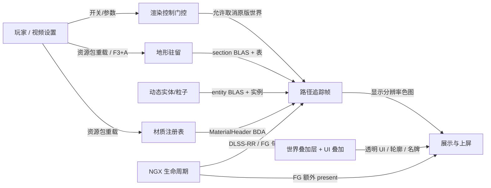
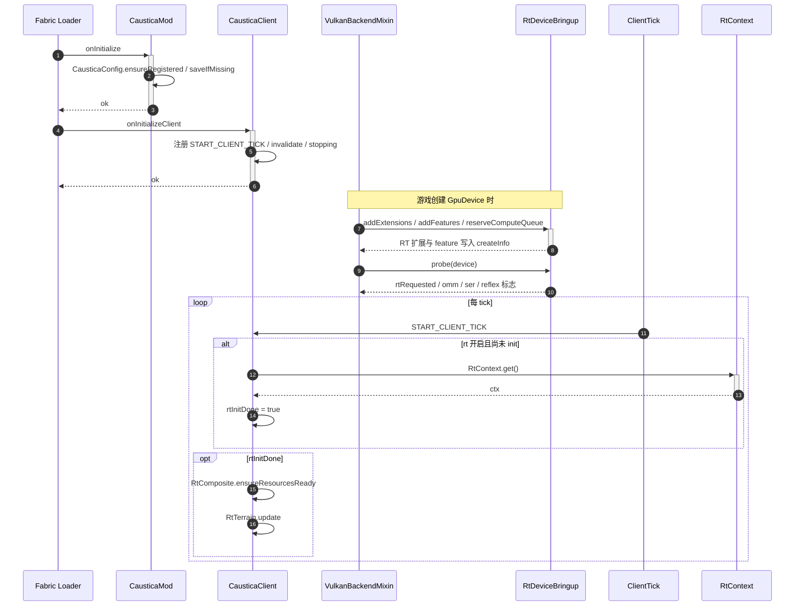
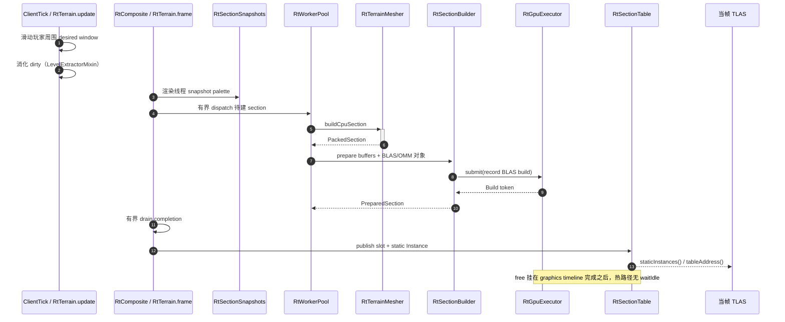
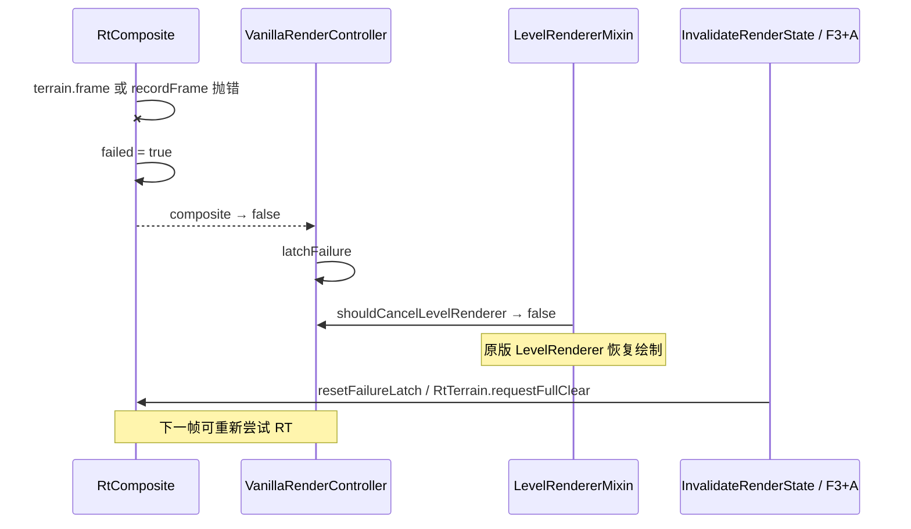
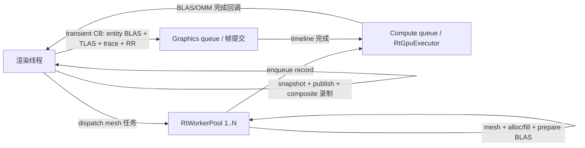
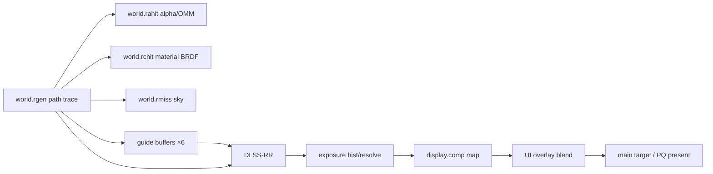

# 1. 架构设计 — Caustica

| 项 | 值 |
|---|---|
| 版本 | A0 |
| 日期 | 2026-07-18 |
| 范围 | 对现有代码库的逆向架构拆解（非目标蓝图） |
| 基线 | `main` @ `9ac4901`（split entity bucket） |
| 栈 | Fabric Mod · Minecraft 26.2 · Java 25 · Vulkan RT · NVIDIA NGX/DLSS · Slang/GLSL |

> 本文按 `project-engineering` 阶段 1 的「分析别人软件」格式写。代码本身没有显式 L0–L3 分层；下文的层归属是从包结构、职责和依赖方向**提取**出来的分析视角，不是仓库里已经声明的架构。

---

## 0. 一句话

Caustica 是 Minecraft 26.2 的 **客户端-only Fabric 模组**：在 Vulkan 后端上接管世界渲染，用硬件路径追踪替换原版世界画面，叠 DLSS Ray Reconstruction / Frame Generation / HDR / Reflex，并尽量保留原版 UI 与玩法。

当前状态：实验性。README 明确写了 bugs、缺视觉案例、频繁变动。

---

## 1. 业务能力图（渲染域，不是 CRUD 业务）

Caustica 没有传统「订单/会话」业务域。可交付的用户结果对应下面几个**渲染能力域**。每个域拥有自己的状态 owner 和不变量。



| 能力域 | 状态 owner | 不变量 / 关键约束 |
|---|---|---|
| 渲染控制门控 | `VanillaRenderController` | 只有「投影已捕获 + RT 就绪 + 未锁失败」才取消 `LevelRenderer`；composite 失败后 latch，回退原版 |
| 地形驻留 | `RtTerrain` + `RtSectionTable` | 驻留窗口跟原版已加载 chunk；section 本地坐标 + rebase；退役走 graphics timeline，不 `waitIdle` |
| 动态实体 | `RtEntities` | 每帧 capture → upload → BLAS → 并入 TLAS；`ENTITY_BIT` / `PARTICLE_BIT` 区分路径 |
| 材质 | `RtMaterialRegistry` | 资源 epoch 内 `Snapshot` 不可变；worker 只读 snapshot；entity 可往预留槽追加 |
| 帧编排 | `RtComposite` | 一帧：terrain.frame → entity.beginFrame → TLAS → trace → RR → exposure → display → copy |
| 展示上屏 | `RtFramePresenter` / `RtHdr` / `VulkanGpuSurfaceMixin` | HDR 走 PQ swapchain；FG 可额外 present；Reflex 打 marker |
| NGX | `NgxRuntime` | 每 Vulkan 设备 init 一次；RR/FG 共享 library，shutdown 在所有 feature 释放之后 |

### 关键用例（用户结果）

| 用户结果 | 主编排者 | 参与域 | 同步关键步骤 | 可独立处理的既成事实 | 验收证据 |
|---|---|---|---|---|---|
| 进入世界看到 RT 画面 | `CausticaClient` tick + `RtComposite.composite` | 控制、地形、材质、帧 | 设备扩展 → RtContext → 材质/pipeline → section 驻留 → 取消 LevelRenderer → composite | 无 | 世界目标被 RT 色图替换，HUD 仍在 |
| 走动时地形流式出现 | `RtTerrain.update` / `frame` | 地形 | 窗口滑动 → snapshot → worker mesh → GPU BLAS → 发布 | section 退役（timeline 完成后再 free） | 新 section 进入 TLAS，出窗 section 被回收 |
| 实体在 RT 场景中可见 | `RtEntities.beginFrame` | 实体、帧 | 收集 ModelPart → 上传 → BLAS → 并入 TLAS | 无（每帧重建） | entity path 在 `world.rchit` 命中 |
| 打开视频设置改 RT 参数 | `CausticaConfig` + `RtVideoOptions` | 控制、帧 | set → 部分即时生效；设备级 feature 需重启 | 写回 `config/caustica.toml` | UI 与 `-D` / toml 一致 |
| 资源包重载后材质正确 | `MinecraftReloadMixin` + registry rebuild | 材质、帧、OMM | tear pipeline → 等新 atlas → rebuild | 旧 atlas view 延迟释放 | 新 LabPBR 图集绑定，无黑图/崩溃 |
| 失败后回退原版 | `VanillaRenderController` + `RtComposite.failed` | 控制 | latch → 不再 cancel LevelRenderer | F3+A / invalidate 清 latch | 画面回到原版世界渲染 |

---

## 2. 分层提取

### 2.1 提取说明

代码按包组织（`client` / `mixin` / `rt/*` / `ngx`），**没有** Protocol/ABC 端口层，也没有「接口在消费方」的显式 DIP。层是分析视角：

| 分析层 | 在本项目中的含义 | 代码落点 |
|---|---|---|
| **入口 / Presentation** | 把 Minecraft 生命周期与渲染缝变成 RT 命令 | `CausticaMod`、`CausticaClient`、`mixin/*`、`client/*` |
| **L3 用例与状态 owner** | 完成一帧/一节地形/一次材质 epoch 的编排与规则 | `RtComposite`、`RtTerrain`、`RtEntities`、`VanillaRenderController`、`RtMaterialRegistry` |
| **L2 通用渲染能力** | 可复用的 AS/管线/材质算法/展示通道，不含「这帧画什么」 | `rt/accel`、`rt/pipeline`、`rt/material/*`（算法侧）、`rt/overlay`、`rt/terrain` 子模块、`ngx`、`shaders/*` |
| **L1 外部事实适配** | Vulkan/MC/NGX SDK 边界、原生 shim | `RtContext`、`RtDeviceBringup`、`RtGpuExecutor`、`RtBuffer`/`RtImage`、`native/ngx_shim`、部分 mixin 对 Vulkan 的钩子 |
| **L0 共享契约与纯工具** | 配置项、生成 ABI、纯分类、诊断标签 | `CausticaConfig`、`rt.gen.*`（构建生成）、`RtMaterials.Profile`、`RtDebugLabels`、`RtFrameStats` |

> 横跨关系：`CausticaConfig` 与生成的 `WorldPushData` / `MaterialHeaderData` 被 L1–L3 广泛读取；它们不含 I/O 业务决策（配置读写本身在入口/L0）。

### 2.2 分层规则差距矩阵

| 规则 | 基线表现 | 迁移/重构优先级 |
|---|---|---|
| 自下而上编号 / 相邻依赖 | 无编号分层；大量单例互相调用（`RtComposite` ↔ `RtTerrain` ↔ `RtEntities`） | 低（单体客户端渲染器，强耦合可接受） |
| 禁止跨层直调 | 多处 L3 直接碰 Vulkan（`RtComposite.recordFrame` 录命令缓冲）；mixin 直改设备创建参数 | 中（已由 `RtContext`/`RtGpuExecutor` 部分收口） |
| 横跨层只放纯数据 | 基本成立：`WorldPushData` 由 Slang 反射生成，Java 不算偏移 | 保持 |
| 层内按变化原因划分子系统 | 包结构已按 terrain/entity/material/pipeline/overlay 划分，较好 | 保持 |
| 零入度检查 | 入口（mod init / mixin）入度零合法；若干 helper 被内部调用 | 无问题 |
| 接口 / DIP | 几乎无 Protocol；单例 + 静态方法 | 低（单实现、无替换需求）；测试只覆盖 material/entity 纯逻辑 |

**客观结论**：这是**以帧管线为中心的单体渲染器**，不是严格六边形架构。上帝对象客观存在：`RtComposite`（~1.7k）、`RtTerrain`（~1.7k）、`RtEntities`（~1.9k）、`RtAccel`（~1.3k）。拆分已在子系统级发生（mesher / section table / OMM / collector），帧主编排仍集中在 `RtComposite.recordFrame`。

---

## 3. 物理清单与按层重排

### 3.1 规模

| 区域 | 规模（约） |
|---|---|
| Java 主源 | ~91 文件，~24k LOC |
| 测试 | 8 文件，~390 LOC（material + entity capture） |
| 着色器 | `world/*.slang`、`display/*.comp`、`overlay/*.{vert,frag}` |
| 原生 | `native/ngx_shim`（C++ FFM 扁平 ABI） |
| 构建 | Fabric Loom + `GenerateShaderRecords`（Slang 反射 → Java record） |

### 3.2 按层重排清单

#### 入口 / Presentation

| 模块 | 职责 |
|---|---|
| `CausticaMod` | 公共入口：注册配置、写默认 toml |
| `CausticaClient` | 客户端入口：tick 拉起 RT、地形 update、shutdown 顺序 |
| `VanillaRenderController` | 每帧是否取消原版世界 / 是否 composite 的门控状态机 |
| `WorldRenderScaler` | 打开/关闭 level-render 窗口，在 before-hand 缝调用 `composite` |
| `RtVideoOptions` | 视频设置 UI 绑定 |
| `mixin/VulkanBackendMixin` | 设备扩展/feature/compute queue 注入 + RT probe |
| `mixin/VulkanInstanceMixin` | instance 级扩展 |
| `mixin/VulkanGpuSurfaceMixin` | PQ swapchain、present、FG/Reflex 缝 |
| `mixin/GameRendererMixin` | 相机捕获、缩放窗口、hand/UI 重定向、overlay 合成 |
| `mixin/LevelRendererMixin` | 条件取消原版 `LevelRenderer.render` |
| `mixin/LevelExtractorMixin` | block dirty → `RtTerrain.markBlocksDirty` |
| `mixin/MinecraftMixin` | Reflex sleep/sim marker；UI overlay 销毁 |
| `mixin/MinecraftReloadMixin` | 资源重载 → pipeline/material tear |
| `mixin/GuiRendererMixin` | GUI 输出重定向到 UI overlay |
| 其余 Accessor mixin | 打开 MC/Vulkan 私有字段（atlas、texture、particle…） |

#### L3 — 用例与状态 owner

| 模块 | 职责 |
|---|---|
| `RtComposite` | **帧主编排**：terrain.frame、entity 帧、TLAS、trace、RR、曝光、display map、写回 main target |
| `RtTerrain` | section 驻留窗口、脏区、异步构建生命周期、静态实例列表 |
| `RtEntities` | 动态实体/粒子/部分 BE 的每帧几何与 BLAS |
| `RtMaterialRegistry` | 材质 epoch、不可变 Snapshot、entity 槽位追加 |
| `VanillaRenderController` | 取消/回退策略（与入口共享，状态属控制域） |
| `RtFramePresenter` | DLSS-FG 额外帧 present |
| `RtUiOverlay` | 透明 UI 目标的生命周期与最终 blend |

#### L2 — 通用渲染能力

| 子系统 | 模块 | 职责 |
|---|---|---|
| 加速结构 | `RtAccel` | BLAS/TLAS/OMM 构建、compaction、TlasRing |
| 地形流水 | `RtTerrainMesher` / `RtFluidMesher` / `RtSectionBuilder` / `RtSectionSnapshots` / `RtSectionTable` / `RtTerrainOmm` / `RtWorkerPool` | CPU mesh、流体、上传、快照缓存、section 表、OMM 分类、线程池 |
| 实体流水 | `RtEntityCollector` / `RtEntityCapture` / `RtParticleCapture` / `RtEntityTextures` / `RtCuboidEmitter` | 模型收集、网格化、粒子、bindless 贴图 |
| 材质算法 | `RtBlockMaterials` / `RtLabPbr` / `RtEmission*` / `RtMaterialOverrides` / `RtMaterialPageTexture` / `RtMaterialDesc` / `RtMaterialAbi` | LabPBR 图集、自发光启发式、覆盖、页纹理、ABI 校验 |
| 管线 | `RtPipeline` / `RtDisplayPipeline` / `RtDlssRr` / `RtDlssFg` / `RtExposure*` / `RtHdr*Pipeline` / `RtSdrPresentPipeline` | RT pipeline+SBT、tone map、DLSS、曝光、HDR/SDR present |
| 叠加层 | `RtWorldOverlay` + `Rt*Feature` + `RtOverlayPipelines` | 方块轮廓、发光描边、名牌（含 ray query） |
| NGX | `NgxRuntime` / `NgxLibrary` | 共享 NGX 初始化与 FFM 绑定 |
| 着色器 | `shaders/world|display|overlay` | path trace、display map、overlay raster |

#### L1 — 外部事实适配

| 模块 | 职责 |
|---|---|
| `RtDeviceBringup` | 在 `vkCreateDevice` 时声明 RT/OMM/SER/Reflex/compute queue 能力 |
| `RtContext` | 单设备上下文：VMA、buffer/image 工厂、同步 submit、GpuExecutor |
| `RtGpuExecutor` | 独立 compute queue 上的 AS 构建提交 + graphics timeline 退役 |
| `RtBuffer` / `RtImage` | Vulkan 缓冲/图像包装 |
| `VulkanDiagnostics` | device-loss / checkpoint / fault 扩展 |
| `RtHdr` / `RtReflex` | HDR 能力与 Reflex 低延迟 API 封装 |
| `native/ngx_shim` | NGX 静态库 → 扁平 C ABI，供 Java FFM 调用 |

#### L0 — 共享契约与纯工具

| 模块 | 职责 |
|---|---|
| `CausticaConfig` | `-D` / toml / 默认值三层配置；嵌套 `Rt.*` 设置组 |
| `rt.gen.WorldPushData` 等 | 构建期从 Slang 反射生成的 Std430 布局 |
| `RtMaterials` | 方块 → Profile（rough/metal）纯分类 |
| `RtDebugLabels` / `RtFrameStats` / `CausticaJitter` | 调试标签、帧阶段计时、Halton jitter |

---

## 4. 代码依赖分层图

```mermaid
graph TB
    classDef entry fill:#e8f5e9,stroke:#2e7d32,stroke-width:2px
    classDef l3 fill:#f3e5f5,stroke:#7b1fa2,stroke-width:2px
    classDef l2 fill:#e1f5fe,stroke:#0277bd,stroke-width:2px
    classDef l1 fill:#fff3e0,stroke:#e65100,stroke-width:2px
    classDef l0 fill:#ffebee,stroke:#c62828,stroke-width:2px,stroke-dasharray:5 5

    subgraph Entry["入口 / Presentation"]
        direction LR
        Mod[CausticaMod / CausticaClient]:::entry
        Mixins[GameRenderer / LevelRenderer / Vulkan* Mixins]:::entry
        Ctrl[VanillaRenderController]:::entry
        Scaler[WorldRenderScaler]:::entry
    end

    subgraph L3["L3 — 帧与状态 owner"]
        direction LR
        Comp[RtComposite]:::l3
        Terr[RtTerrain]:::l3
        Ent[RtEntities]:::l3
        MatReg[RtMaterialRegistry]:::l3
        UiOv[RtUiOverlay / RtWorldOverlay]:::l3
        Presenter[RtFramePresenter]:::l3
    end

    subgraph L2["L2 — 渲染能力"]
        direction LR
        Accel[RtAccel]:::l2
        Pipe[RtPipeline / Display / Exposure]:::l2
        MatAlg[BlockMaterials / LabPBR / OMM]:::l2
        Mesh[Mesher / Snapshots / SectionTable]:::l2
        Cap[EntityCapture / Collector / Textures]:::l2
        Dlss[RtDlssRr / RtDlssFg]:::l2
        Shaders[Slang / GLSL SPIR-V]:::l2
    end

    subgraph L1["L1 — 设备与资源适配"]
        direction LR
        Bring[RtDeviceBringup]:::l1
        Ctx[RtContext]:::l1
        GpuEx[RtGpuExecutor]:::l1
        Buf[RtBuffer / RtImage]:::l1
        Ngx[NgxRuntime + ngx_shim]:::l1
        Diag[VulkanDiagnostics / RtReflex / RtHdr]:::l1
    end

    subgraph L0["L0 — 配置与 ABI 契约"]
        direction LR
        Cfg[CausticaConfig]:::l0
        Gen[WorldPushData / MaterialHeaderData]:::l0
        Prof[RtMaterials.Profile]:::l0
        Stats[RtFrameStats / DebugLabels / Jitter]:::l0
    end

    %% Entry → L3
    Mod --> Comp
    Mod --> Terr
    Mixins --> Ctrl
    Mixins --> Scaler
    Mixins --> Comp
    Mixins --> UiOv
    Scaler --> Comp
    Ctrl --> Comp
    Ctrl --> Terr

    %% L3 → L2
    Comp --> Accel
    Comp --> Pipe
    Comp --> Dlss
    Comp --> Ent
    Comp --> Terr
    Comp --> MatReg
    Terr --> Mesh
    Terr --> Accel
    Terr --> MatAlg
    Ent --> Cap
    Ent --> Accel
    MatReg --> MatAlg
    UiOv --> Pipe
    Presenter --> Dlss
    Pipe --> Shaders
    Dlss --> Ngx

    %% L2/L3 → L1
    Comp --> Ctx
    Terr --> GpuEx
    Accel --> Buf
    Pipe --> Ctx
    Bring --> Ctx
    GpuEx --> Ctx
    Ngx --> Ctx
    Mixins --> Bring
    Mixins --> Diag

    %% 弱依赖配置/ABI
    Comp -.-> Cfg
    Comp -.-> Gen
    Terr -.-> Cfg
    MatReg -.-> Gen
    MatAlg -.-> Prof
    Comp -.-> Stats

    style Entry fill:#e8f5e9,stroke:#2e7d32,stroke-width:3px
    style L3 fill:#f3e5f5,stroke:#7b1fa2,stroke-width:3px
    style L2 fill:#e1f5fe,stroke:#0277bd,stroke-width:3px
    style L1 fill:#fff3e0,stroke:#e65100,stroke-width:3px
    style L0 fill:#ffebee,stroke:#c62828,stroke-width:3px,stroke-dasharray:5 5
```



**红虚线级跨层事实（客观记录，不粉饰）**：

- `RtComposite.recordFrame` 直接拿 `VulkanCommandEncoder`、录 `VkCommandBuffer`、调 `vkCmdCopyImage` —— L3 触碰 L1/Vulkan。
- Mixin 在 `vkCreateDevice` / swapchain / present 点直接改引擎行为 —— 入口层与 L1 融合，这是 Minecraft 模组的常态，不是疏忽。
- `RtTerrain` / `RtEntities` / `RtComposite` 三角互相引用（composite 调 terrain.frame 与 entities.beginFrame；terrain 引用 composite 配置/失败路径）。

---

## 5. 关键时序

### 5.1 启动与设备协商



### 5.2 单帧：取消原版世界 → RT composite → UI

```mermaid
sequenceDiagram
    autonumber
    participant GR as GameRenderer
    participant GRM as GameRendererMixin
    participant Scaler as WorldRenderScaler
    participant VRC as VanillaRenderController
    participant LR as LevelRendererMixin
    participant Comp as RtComposite
    participant Terr as RtTerrain
    participant Ent as RtEntities
    participant Accel as RtAccel
    participant Pipe as RtPipeline
    participant RR as RtDlssRr
    participant UI as RtUiOverlay
    participant Surf as VulkanGpuSurfaceMixin

    GRM->>UI: beginFrame
    GRM->>Comp: beginFrame
    GRM->>Scaler: begin(mainTarget)
    Scaler->>VRC: beginFrame / shouldCompositeRt

    GR->>GR: renderLevel → 构建 projection
    GRM->>Comp: captureFrame(proj, view, cam)
    GRM->>VRC: markProjectionCaptured

    GR->>+LR: LevelRenderer.render
    LR->>VRC: shouldCancelLevelRenderer
    alt 门控通过
        LR->>VRC: markWorldSkipped
        LR--xLR: ci.cancel 原版世界绘制
    else 未就绪 / 已失败
        LR-->>GR: 走原版路径
    end

    GRM->>Scaler: end(mainTarget)  before-hand 缝
    Scaler->>+Comp: composite(color, w, h)
    Comp->>Terr: frame(ctx)  有界 streaming
    Comp->>Ent: beginFrame(...)  capture+upload+BLAS 准备
    Comp->>Accel: recordBlasBuilds / prepareTlas / recordTlasBuild
    Comp->>Pipe: trace(renderW, renderH)
    opt DLSS-RR 开启
        Comp->>RR: evaluate → display res
    else
        Comp->>Comp: blitUpscale
    end
    Comp->>Comp: exposure + display map + copy to main
    Comp-->>-Scaler: success/fail
    Scaler->>VRC: markRtCompositeResult

    GRM->>Comp: finishTerrainGraphicsUse
    GRM->>UI: world overlay → UI target；hand/GUI 重定向
    GRM->>UI: compositeIfUsed 叠回 main / HDR

    Surf->>Surf: present（PQ / FG 额外帧 / Reflex marker）
    GRM->>Comp: endFrame
```

### 5.3 地形 section 异步生命周期



### 5.4 失败回退



---

## 6. 接口与契约清单（来自代码事实，不臆造）

本仓库几乎不用 Java `interface`/`Protocol`。契约以 **单例方法签名 + 生成 ABI + Vulkan/NGX 边界** 形式存在。

### 6.1 帧主编排（L3）

| 契约 | 位置 | 语义 |
|---|---|---|
| `RtComposite.captureFrame(proj, viewRot, camXYZ)` | `RtComposite.java` | 在 level projection 构建点捕获相机 |
| `RtComposite.composite(nativeColor, w, h) → boolean` | 同上 | 跑完整 RT 帧；失败 latch |
| `RtComposite.ensureResourcesReady(ctx)` | 同上 | tick 侧提前建 pipeline/材质 |
| `RtComposite.beginFrame / endFrame / finishTerrainGraphicsUse` | 同上 | 帧边界与 terrain 退役信号 |
| `VanillaRenderController.shouldCancelLevelRenderer(...)` | `VanillaRenderController.java` | 是否跳过原版世界 |
| `WorldRenderScaler.begin/end` | `WorldRenderScaler.java` | before-hand 缝触发 composite |

### 6.2 地形（L3/L2）

| 契约 | 位置 | 语义 |
|---|---|---|
| `RtTerrain.update(ctx)` | tick | 窗口与脏区维护 |
| `RtTerrain.frame(ctx)` | 每渲染帧 | 有界 dispatch/drain/publish |
| `RtTerrain.staticInstances()` / `tableAddress()` | 供 TLAS / hit shader | 已发布 section |
| `RtTerrain.markBlocksDirty(...)` | 来自 LevelExtractorMixin | 几何脏 |
| `RtTerrain.requestFullClear()` / `shutdown(ctx)` | invalidate / 退出 | 整表清空 / 有序关停 |
| `RtGpuExecutor.submit / beginGraphicsTerrainUse / enqueueDestroyAfterGraphics` | `RtGpuExecutor.java` | 异步构建与安全退役 |

### 6.3 实体（L3）

| 契约 | 位置 | 语义 |
|---|---|---|
| `RtEntities.beginFrame(ctx, base, rebase, cam, proj, view) → FrameEntities` | `RtEntities.java` | 动态实例 + BLAS 列表 + geom table BDA |
| `ENTITY_BIT` / `PARTICLE_BIT` | 同上 | instanceCustomIndex 标志 |
| `glowBatches` / `nameTagBatches` | 同上 | 供 overlay 光栅 |

### 6.4 材质（L2/L3）

| 契约 | 位置 | 语义 |
|---|---|---|
| `RtMaterialRegistry.rebuild(ctx, blockMaterials, overrides)` | 资源 epoch | 重建 GPU 表 |
| `requireSnapshot()` / `tableAddress()` / `epoch()` | 同上 | worker 只读 snapshot；shader BDA |
| `resolve` / `resolveEntityTexture` / `withStochasticAlpha` | 同上 | ID 解析 |
| `MaterialHeaderData`（生成） | `rt.gen` | 与 `world_common.slang` 同布局 |
| `RtMaterials.profile(state)` | 纯函数 | DEFAULT/METAL/GLASS/SMOOTH |

### 6.5 加速结构（L2）

| 契约 | 位置 | 语义 |
|---|---|---|
| `RtAccel.prepareTlas` / `recordTlasBuild` | `RtAccel.java` | 每帧 TLAS |
| `recordBlasBuilds` / terrain compaction / OMM build | 同上 | section/entity BLAS |
| `TlasRing` | 同上 | 与 frames-in-flight 对齐的退役环 |

### 6.6 设备与 NGX（L1）

| 契约 | 位置 | 语义 |
|---|---|---|
| `RtDeviceBringup.addExtensions/addFeatures/probe/rtRequested` | 设备创建时 | 能力门控；**运行时改配置不能补 feature** |
| `RtContext.get/createBuffer/createStorageImage/submitSync` | 设备资源 | 单例上下文 |
| `NgxRuntime.acquire(device)` / `shutdown()` | NGX | 每设备一次 init |
| `ngx_shim` C ABI | `native/ngx_shim.cpp` | init/evaluate/release DLSS-RR/FG |

### 6.7 Shader ABI（L0 生成）

| 契约 | 生成源 | 消费者 |
|---|---|---|
| `WorldPushData` + `WorldPushConstantsData` | Slang 反射 → `GenerateShaderRecords` | `RtComposite` 写、`world.rgen` 读 |
| `MaterialHeaderData` | 同上 | `RtMaterialRegistry` 写、hit shader 读 |
| 规则 | Java **不算** 字段偏移；布局唯一真相在 Slang | 破则构建失败 |

---

## 7. 并发与线程模型



| 线程/队列 | 允许 | 禁止 |
|---|---|---|
| 渲染线程 | snapshot、发布 section、录 composite、读 MC 客户端状态 | 重 tessellation 爆帧 |
| `RtWorkerPool` | CPU mesh、缓冲填充、准备 AS 对象、enqueue 到 GpuExecutor | 碰 graphics queue；直接改 published 表 |
| `RtGpuExecutor`（自有 compute queue） | 异步 BLAS/OMM build submit | 被多所有者并发 submit |
| Graphics 提交 | 帧内 entity BLAS + TLAS + trace + present 路径 | 热路径 `waitIdle` |

有界参数（配置）：`terrain.async-dispatch-per-pass`、`completion-results-per-pass`、`max-inflight-sections`、`worker-threads`。

---

## 8. 配置与功能门控

配置解析顺序：`-Dcaustica.*` → `config/caustica.toml` → 硬编码默认（`CausticaConfig`）。

主要开关组（代码中的嵌套类，非完整键表）：

| 组 | 作用 |
|---|---|
| `Rt.ENABLED` | 总开关；设备 feature 在 createDevice 时读一次 |
| `Rt.Composite` | spp、bounces、debug view、water waves… |
| `Rt.Terrain` | 流式有界参数、inflight |
| `Rt.Omm` | opacity micromap |
| `Rt.Entities` / `EntityTextures` | 实体/粒子/glow/名牌/贴图上限 |
| `Rt.DlssRr` / `Rt.Fg` | RR 与 Frame Generation（FG 默认偏关） |
| `Rt.Reflex` / `Rt.Hdr` / `Rt.Exposure` | 低延迟、PQ HDR、曝光模式 |
| `Ngx.PATH` | NGX 运行时路径覆盖 |

能力降级链（客观行为）：

1. 设备无 RT 扩展 → 不 enable feature → 全程原版。
2. RT 开但 terrain 未就绪 → 不 cancel LevelRenderer（或等待 player section）。
3. composite 异常 → `failed` latch → 回退原版，直到 F3+A / invalidate。
4. RR 不可用 → 1:1 blit 上屏（噪声参考路径）。
5. HDR PQ 不可用 → SDR swapchain。

---

## 9. 着色器与显示管线（逻辑）



- 主世界：Slang RT 管线（SER 重排路径由 `RtDeviceBringup.worldRaygenShader()` 选择）。
- 展示：compute（display / exposure / HDR UI / SDR present）。
- 叠加：传统 vert/frag（轮廓 ray query、glow、名牌）。

---

## 10. 构建与原生边界

| 组件 | 作用 |
|---|---|
| Fabric Loom | MC 26.2 模组构建；`loom.disableObfuscation=true` |
| `glslangValidator` / `slangc` / `spirv-val` | 着色器编译进资源 |
| `GenerateShaderRecords` | Slang 反射 → `WorldPushData` / `MaterialHeaderData` |
| CMake `native/ngx_shim` | 链接 NGX 静态库，产出平台 DLL/SO |
| Gradle 打包 | 按主机平台捆绑 NGX natives；可 `-PngxPlatforms=...` 跨平台 |

运行前提：`VULKAN_SDK`、`DLSS_SDK`；客户端参数 `--graphicsBackend VULKAN`；Java `--enable-native-access`、较大 `-Xss`。

---

## 11. 已知风险与客观瑕疵

1. **上帝对象**：`RtComposite` / `RtTerrain` / `RtEntities` 体量大，帧逻辑与资源生命周期缠在一起，改一处易牵动全局。
2. **单例网**：`INSTANCE` 遍地，利于 MC 钩子接入，不利于单测与并行演进；测试覆盖集中在 material 纯函数与少量 entity capture。
3. **设备级配置不可热切换**：`caustica.rt` 等 feature 在 `vkCreateDevice` 时定死，文档与代码均承认需重启。
4. **与其它渲染模组冲突**：接管 `LevelRenderer` 与 Vulkan 设备协商，和改世界管线/后处理的模组不兼容（README 已声明）。
5. **平台耦合**：DLSS/NGX/Reflex 为 NVIDIA 路径；非 NVIDIA 的 NRD/FSR 仍在 TODO。
6. **跨层 Vulkan 调用**：帧录制未完全收敛到「只经 L2 命令构建器」；诊断与性能目前优先于纯分层。
7. **资源重载窗口**：atlas 句柄延迟释放期间主动 skip RT，逻辑正确但会造成短暂原版回退闪帧。
8. **未完成视觉域**：Nether/End sky、天气、体积雾/云、LOD、ReSTIR 仍在 README TODO。

---

## 12. 与「目标分层」的对照（分析用，非改造承诺）

| 维度 | 当前（基线） | 若按 skill 严格 L0–L3 收敛 |
|---|---|---|
| 层数 | 包级子系统 + 隐式帧管线 | 入口 / L3 owner / L2 能力 / L1 适配 / L0 ABI |
| 上帝对象 | 有（Composite/Terrain/Entities） | 帧用例只编排；mesh/AS/present 下沉 L2 |
| 跨层访问 | Composite 直接 Vulkan | 经 `ICommandRecorder` / `IGpuDevice` 端口 |
| 展现耦合 | Mixin 深入 MC 渲染缝 | 无法消除（模组本质）；可收窄为「缝模块」 |
| 可扩展性 | 新能力多挂进 Composite/Config | 新域加 owner + 在 composite 注册阶段钩子 |
| 可测性 | 纯 material 可测；帧路径靠真机 | L2 算法单测 + 录制层 fake |

**当前阶段建议**：架构文档先固化「状态 owner + 帧时序 + ABI 真相源」，不急着为分层而分层。后续若拆 `RtComposite.recordFrame`，优先按阶段切（terrain publish / entity / tlas+trace / post），而不是先引入空接口。

---

## 13. 源码导航（按任务）

| 想改什么 | 先读 |
|---|---|
| 总开关 / 默认参数 | `CausticaConfig.java`、`client/RtVideoOptions.java` |
| 设备能不能上 RT | `RtDeviceBringup.java`、`mixin/VulkanBackendMixin.java` |
| 为什么原版世界没了 | `VanillaRenderController.java`、`mixin/LevelRendererMixin.java` |
| 一帧 RT 怎么走完 | `RtComposite.recordFrame`、`client/WorldRenderScaler.java`、`mixin/GameRendererMixin.java` |
| 地形洞 / 不更新 | `RtTerrain.java`、`LevelExtractorMixin`、`RtSectionSnapshots` |
| 实体消失 / 爆 CPU | `RtEntities.java`、`RtEntityCollector.java` |
| 材质 / LabPBR | `RtMaterialRegistry`、`RtBlockMaterials`、`RtLabPbr` |
| 噪点 / 锐度 / 分辨率 | `RtDlssRr`、`CausticaJitter`、`shaders/world.rgen.slang` |
| HDR / 黑菜单 | `RtHdr`、`RtUiOverlay`、`VulkanGpuSurfaceMixin`、`RtComposite.beginFrame` |
| NGX 崩溃 | `ngx/NgxRuntime`、`native/ngx_shim`、`docs/developer_guide.md` |
| 关停顺序 / 退出崩 | `CausticaClient.shutdownRt` |

---

## 14. 附录：包 → 分析层速查

| 包 | 层 |
|---|---|
| `dev.comfyfluffy.caustica` | L0 配置 + 入口 |
| `...client` | 入口 / 控制 |
| `...mixin` | 入口（MC/Vulkan 缝） |
| `...rt`（根上 Composite/Context/…） | L3 编排 + L1 设备 |
| `...rt.terrain` | L3 owner + L2 流水线 |
| `...rt.entity` | L3 owner + L2 捕获 |
| `...rt.material` | L3 registry + L2 算法 |
| `...rt.pipeline` | L2 |
| `...rt.accel` | L2（贴 L1 资源） |
| `...rt.overlay` | L2/L3 边界（读 TLAS，写 UI） |
| `...ngx` | L1 |
| `shaders/*` | L2 实现 |
| `native/ngx_shim` | L1 |
| `rt.gen.*`（生成） | L0 ABI |

---

*文档性质：逆向架构事实 + 分析分层。未执行阶段 0 需求文档；若后续要做重构蓝图，先补 `0-DEMAND.md` 中的用户结果与验收，再改本文件版本号（A1+）。*
